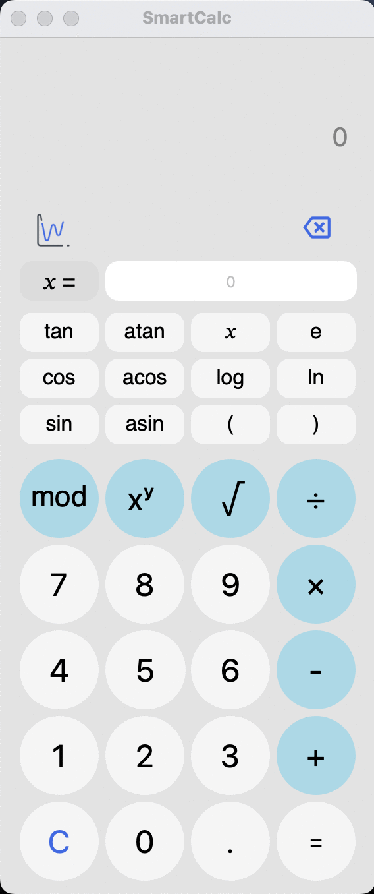
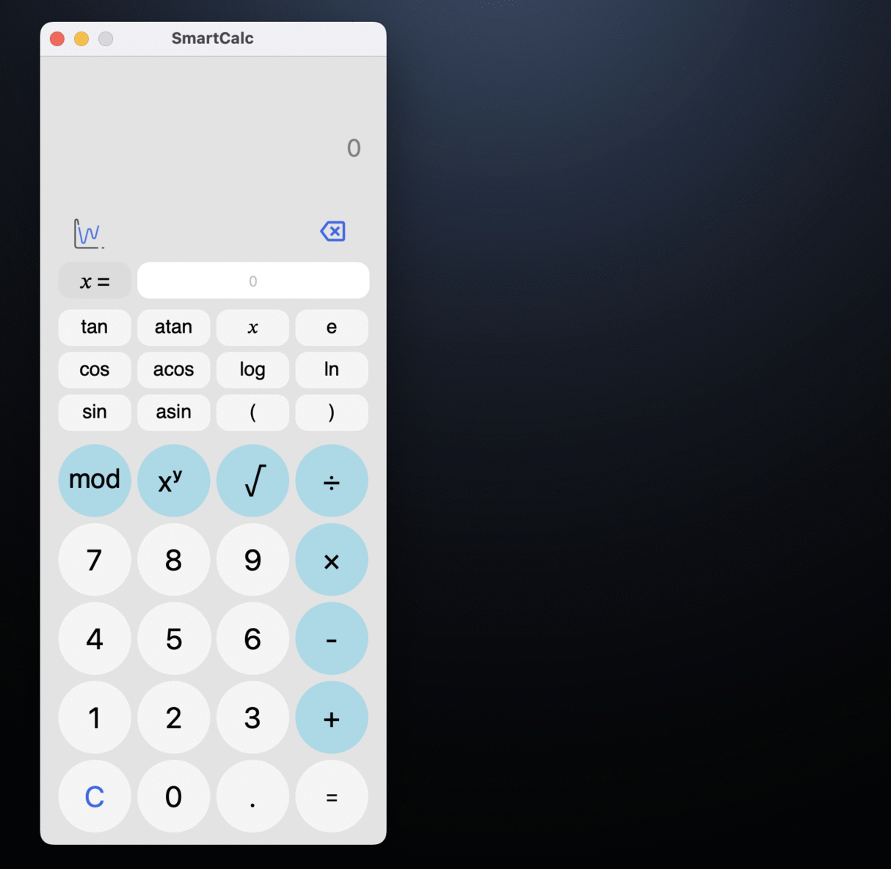

# SmartCalc v2.0

#### Implementation of an extended version of a conventional calculator in C++17.

The russian version of the task can be found in the repository.

In addition to basic arithmetic operations, such as plus-minus and multiply-divide, it is possible to calculate arithmetic expressions taking into account priorities, as well as some mathematical functions (sin, cos, logarithm, etc.).
It is supported to use the variable *x* and plot the corresponding function.

  

  

- The program is developed in C++ language of C++17 standard.
- The program code is located in *src* folder.
- The code of the program is written in accordance with Google style;
- Classes are implemented within the `s21` namespace.
- Full coverage of expression calculation modules is provided with unit-tests using the GTest library;
- The program implements GUI based on Qt 6.7.
- The program is implemented using the MVC pattern.
- Makefile with targets *all, install, uninstall, clean, check_style, dvi, dist, test, gcov_report* is provided.
- Installation directory - `src/build`.
- `dvi` target provides with *doxygen* style documentation.
- `dist` target generates a zipped .tar file of archive for distribution.

### Implementation

#### MVC pattern

The Model-View-Controller (MVC) pattern is a scheme for separating application modules into three macro components: a model that contains the business logic, a view that is a UI form for interacting with the program, and a controller that modifies the model by user action.

The `view` contains all the code associated with the program interface, while `model`performs the calculation.

#### Calculation

The calculation is based on *Dijkstra's algorithm* or the *shunting-yard algorithm* to translate expressions into *reverse Polish notation* to implement the calculation.

The Shunting-yard algorithm is stack-based. There are two text variables involved in the conversion: the input and the output string. The conversion process uses the stack to store operations not yet added to the output string. The conversion program sequentially reads each token from the input string and on each step does some actions based on which tokens have been read.

#### Implementation of the algorithm

As long as there are unprocessed tokens in the input string, read the next token:

If the token is:
- A number – put it into the output queue

- A function or a left parenthesis – push it onto the stack

- A function arguments separator (e.g. comma):
    - Move operators from the stack to the output queue until the token at the top of the stack is a left parenthesis. If there is no left parenthesis in the stack, there is an error in the expression.

- Operator (O1):
    - While there is a token-operator O2 at the top of the stack, that has greater precedence than O1 or they have the same precedence and O1 is left-associative:
    - Pop O2 from the stack into the output queue
    - Push O1 onto the stack

- A right parenthesis:
    - While the token at the top of the stack is not a left parenthesis, pop the token-operators from the stack into the output queue.
    - Pop the left parenthesis from the stack and discard it.
    - If there is a function token at the top of the stack, then pop the function from the stack into the output queue
    - If the stack ended before the left parenthesis was read, there is an error in the expression.

If there are no more tokens left in the input string:
- As long as there are operators in the stack:
    - If there is a parenthesis at the top of the stack - there is an error in the expression.
    - Pop the operator from the stack onto the output queue

End.