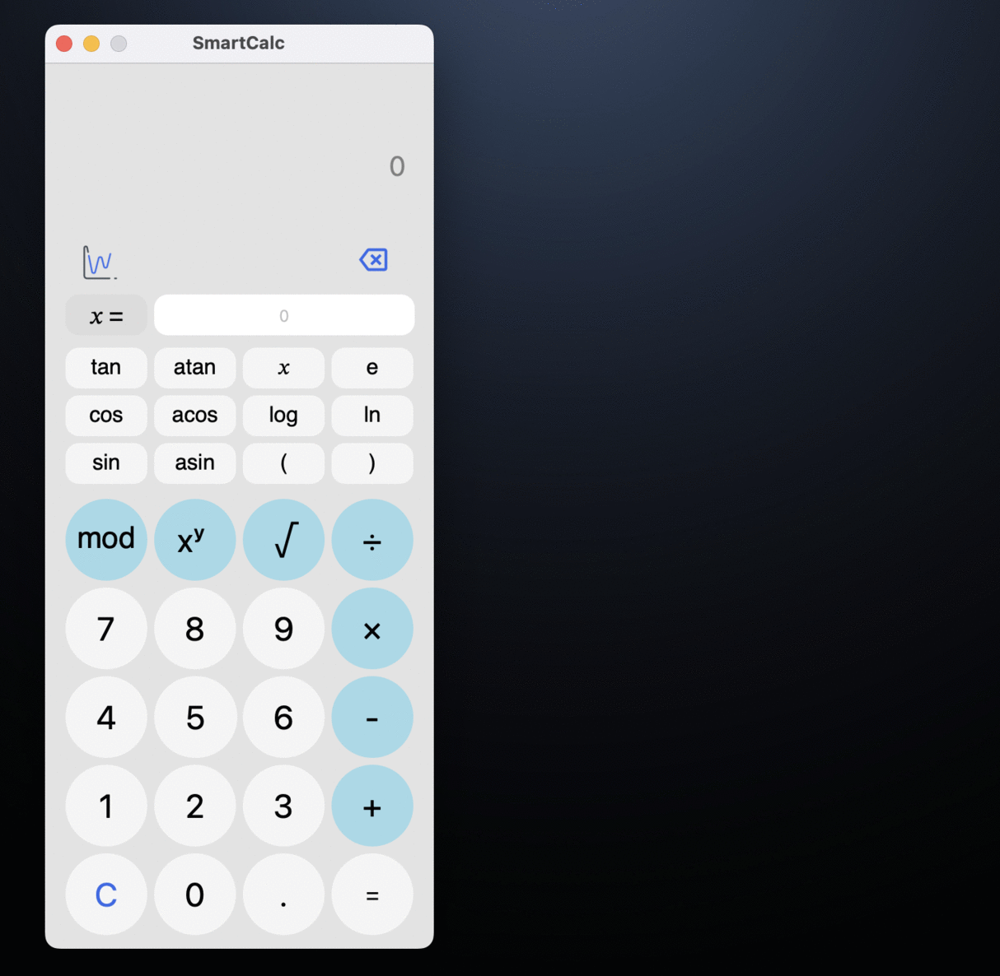

# SmartCalc v2.0

#### Реализация расширенной версии обычного калькулятора на С++17.

Помимо базовых арифметических операций, как плюс-минус и умножить-поделить, предусмотрено вычисление арифметических выражений с учетом приоритетов, а также некоторыми математическими функциями (синус, косинус, логарифм и т.д.). Поддерживается использование переменной *x* и построение графика соответствующей функции.

  

  

- Программа разработана на языке C++ стандарта C++17 с использованием компилятора gcc;
- Код программы находится в папке *src*;
- Код написан в соответствии с Google Style;
- Классы реализованы внутри пространства имен `s21`;
- Подготовлено полное покрытие unit-тестами классов для вычислений c помощью библиотеки GTest;
- Реализован графический интерфейс пользователя на базе Qt 6.7.
- Программа реализована на основе MVC-паттерна.
- Предусмотрен Makefile для сборки библиотеки с целями *all, install, uninstall, clean, check_style, dvi, dist, test, gcov_report*.
- Директория установки - `src/build`.
- Цель `dvi` обеспечивает доступ к документации, оформленной с помощью doxygen.
- Цель `dist` выполняет создание tar-файла, содержащего дистрибутивную   
  поставку программы.

### Реализация

### Паттерн MVC

Паттерн MVC (Model-View-Controller, Модель-Представление-Контроллер) представляет из себя схему разделения модулей приложения на три отдельных макрокомпонента: модель, содержащую в себе бизнес-логику, представление (форму пользовательского интерфейса для осуществления взаимодействия с программой) и контроллер, осуществляющий модификацию модели по действию пользователя.

Модель хранит и осуществляет доступ к основным данным, производит по запросам операции, определенные бизнес-логикой программы, то есть отвечает за ту часть программы, которая ответственна за все алгоритмы и процессы обработки информации. Данные модели, изменяясь под действием контроллера, влияют на отображение информации на представлении пользовательского интерфейса. В качестве модели в данной программе должна выступить библиотека классов, осуществляющая вычисления калькулятора. Эта библиотека должна предоставлять все необходимые классы и методы для осуществления подсчетов. Это и есть бизнес-логика данной программы, так как предоставляет средства для решения задачи. 

К `представлению` относится весь код, связанный с интерфейсом программы, в то время как `модель` отвечает за выполнение вычислений.

#### Вычисления 

Процесс вычислений основан на *алгоритме Дейкстры*, так же называемом *Сортировочная станция*, который переводит выражение из инфиксной в обратную польскую нотацию.

Алгоритм сортировочной станции основан на стеке. В преобразовании участвуют две текстовые переменные: входная и выходная строки. В процессе преобразования используется стек, хранящий ещё не добавленные к выходной строке операции. Преобразующая программа последовательно считывает лексемы из входной строки, выполняя на каждом шаге некоторые действия, зависящие от того, какая лексема была считана.

#### Реализация алгоритма

Пока в исходной строке есть необработанные лексемы, считываем очередную:

Если лексема:
- Число - добавляем в строку вывода.
- Функция или открывающая скобка - помещаем в стек.
- Разделитель аргументов функции (например, запятая):
    - Перекладываем операторы из стека в выходную очередь пока лексемой на вершине стека не станет открывающая скобка. Если в стеке не окажется открывающей скобки - в выражении допущена ошибка.
- Оператор (O1):
    - Пока присутствует на вершине стека лексема-оператор (O2) чей приоритет выше приоритета O1, либо при равенстве приоритетов O1 является левоассоциативным:
        - Перекладываем O2 из стека в выходную очередь.
    - Помещаем O1 в стек.
- Закрывающая скобка:
    - Пока лексема на вершине стека не станет открывающей скобкой, перекладываем лексемы-операторы из стека в выходную очередь.
    - Удаляем из стека открывающую скобку.
    - Если лексема на вершине стека — функция, перекладываем её в выходную очередь.
    - Если стек закончился до того, как была встречена открывающая скобка - в выражении содержится ошибка.

Если во входной строке больше не осталось лексем:
- Пока есть операторы в стеке:
    - Если на вершине стека скобка - в выражении допущена ошибка.
    - Перекладываем оператор из стека в выходную очередь.

Конец.

---

 risahamm@student.21-school.ru
